# School_District_Analysis

## Overview

A city school district board requested analysis on the math and reading performance for high school students in the district along several metrics.  After I performed the initial analysis, evidence of academic dishonesty was discovered affecting reading and math grades for ninth grade students at one of the high schools, Thomas High School.  I removed the reading and math grades for all Thomas High School ninth graders and updated the analysis, as can be seen in a section of the data below:

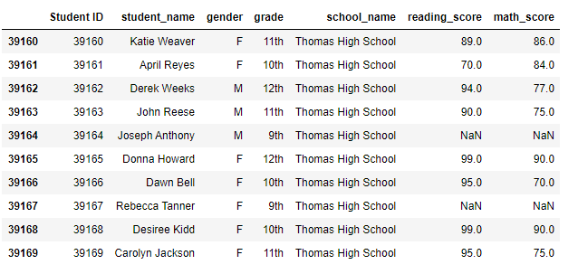

This report details the differences in the analyses once the grades were removed.

## Results

- District Summary

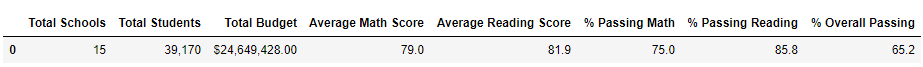
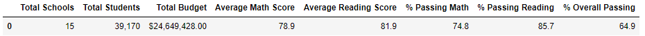
- School Summary
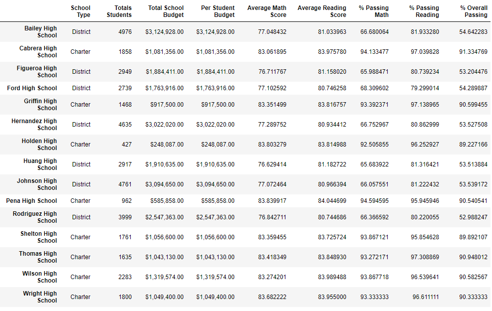
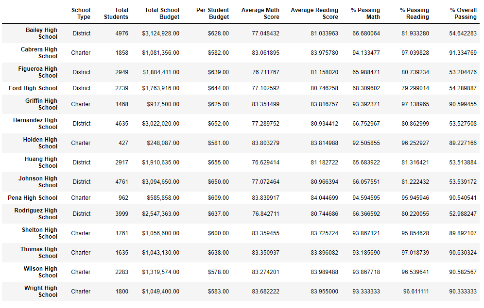
- Thomas High School's Relative Performance
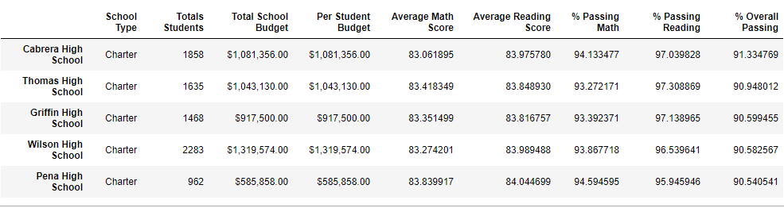
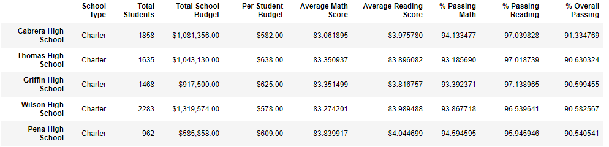
- Math and Reading Scores by Grade
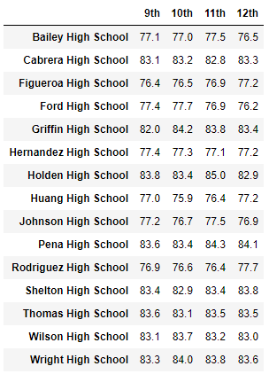
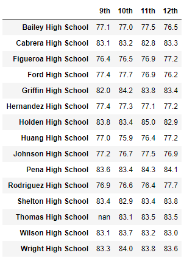
- Scores by School Spending
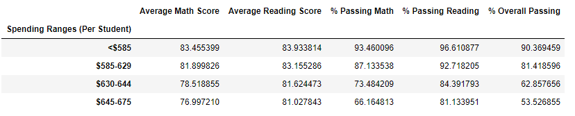
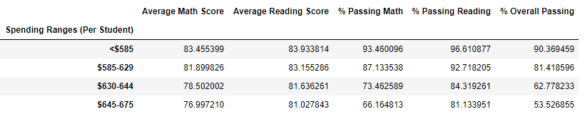

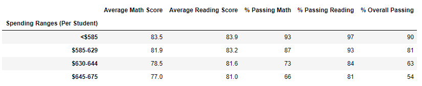
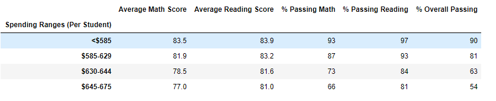
- Scores by School Size
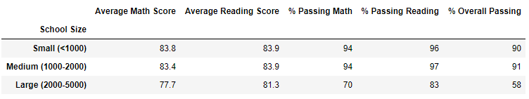
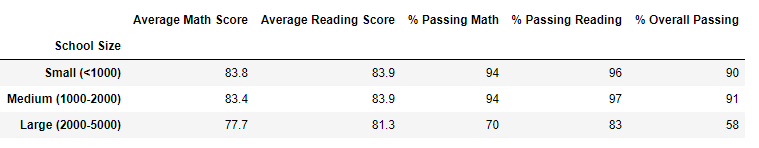
- Scores by School Type
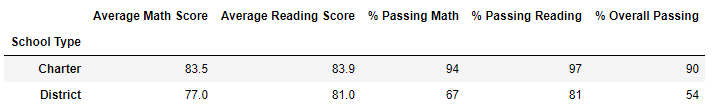
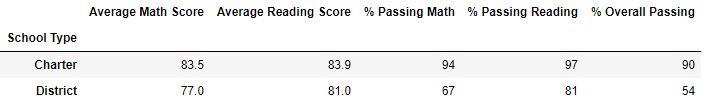
## Summary